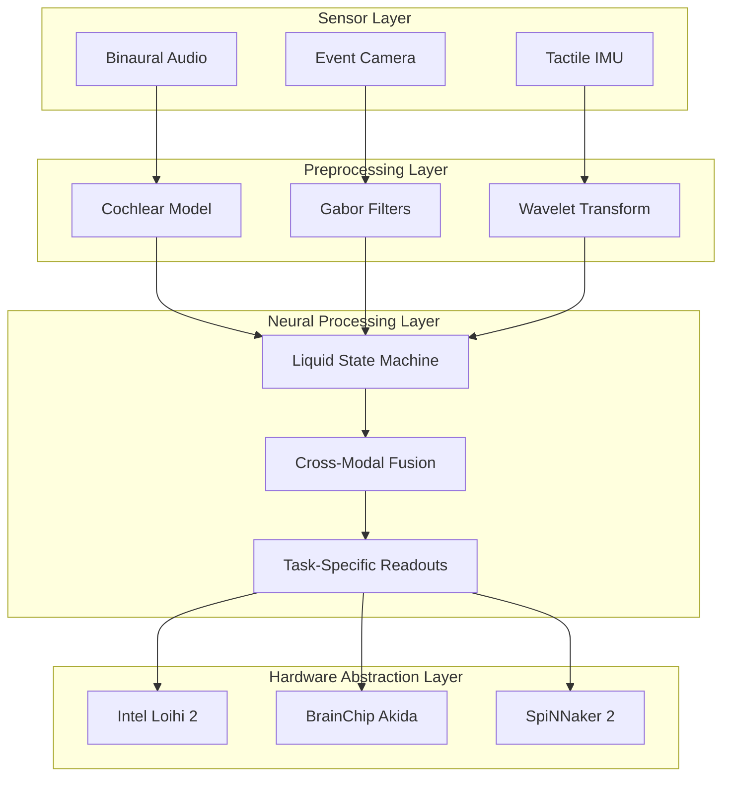

# Multi-Sensor SNN-Fusion Architecture

## Overview

The Multi-Sensor SNN-Fusion system implements a neuromorphic computing architecture that processes asynchronous multi-modal sensory data through spiking neural networks. The system is designed for ultra-low latency sensor fusion on neuromorphic hardware platforms.

## System Architecture

### High-Level Architecture



## Core Components

### 1. Sensor Input Processing

#### Audio Processing Pipeline
- **Input**: Binaural audio streams (48kHz, 2-channel)
- **Encoding**: Cochlear model with 64 frequency channels
- **Output**: Spike trains representing auditory features
- **Latency**: <2ms from audio to spikes

#### Event-Based Vision Processing
- **Input**: Event camera streams (346x260 resolution)
- **Encoding**: Gabor filter banks for spatial-temporal features
- **Output**: ON/OFF event spike patterns
- **Latency**: <1ms event-to-spike

#### Tactile IMU Processing
- **Input**: 6-DOF IMU data (1kHz sampling)
- **Encoding**: Continuous wavelet transform
- **Output**: Encoded acceleration/gyroscope spikes
- **Latency**: <0.5ms tactile-to-spike

### 2. Liquid State Machine (LSM)

The LSM serves as the central reservoir computing component:

```python
LSM_Configuration = {
    'reservoir_size': 1000,           # Number of neurons in reservoir
    'connectivity': 0.1,              # Connection probability
    'spectral_radius': 0.9,           # Network stability parameter
    'neuron_model': 'adaptive_lif',   # Leaky integrate-and-fire
    'tau_mem': 20.0,                 # Membrane time constant (ms)
    'tau_adapt': 100.0               # Adaptation time constant (ms)
}
```

#### Reservoir Dynamics
- **Recurrent Connectivity**: Sparse random connections (10% density)
- **Neuron Model**: Adaptive Leaky Integrate-and-Fire
- **Plasticity**: Short-term synaptic dynamics
- **Memory**: ~100ms temporal integration window

### 3. Cross-Modal Fusion

#### Attention-Based Fusion
```python
FusionArchitecture = {
    'attention_mechanism': 'multi_head',
    'num_heads': 4,
    'fusion_type': 'gated_multimodal',
    'temporal_integration': 'sliding_window',
    'window_size_ms': 50
}
```

#### Fusion Strategies
1. **Early Fusion**: Concatenation at spike level
2. **Late Fusion**: Decision-level combination
3. **Hybrid Fusion**: Multi-level integration with attention

### 4. Task-Specific Readouts

#### Classification Head
- **Architecture**: Linear readout from LSM states
- **Output**: Softmax over action classes
- **Training**: Supervised learning with temporal credit assignment

#### Localization Head
- **Architecture**: Regression from fused features
- **Output**: 3D position estimates
- **Training**: MSE loss with temporal smoothing

#### Segmentation Head
- **Architecture**: Deconvolutional spike-based network
- **Output**: Spatial segmentation maps
- **Training**: Cross-entropy with spatial consistency

## Data Flow Architecture

### Temporal Processing Pipeline

```
Time Step t: Audio[t] → Cochlear → Spikes[t]
Time Step t: Events[t] → Gabor → Spikes[t]
Time Step t: IMU[t] → Wavelet → Spikes[t]
                ↓
Time Step t: Reservoir State Update
                ↓
Time Step t: Cross-Modal Attention
                ↓
Time Step t: Task Readouts → Predictions[t]
```

### Memory Hierarchy

1. **Short-Term**: LSM reservoir states (100ms)
2. **Medium-Term**: Attention weights (500ms)
3. **Long-Term**: Synaptic weights (persistent)

## Hardware Mapping

### Intel Loihi 2 Architecture

```python
LoihiMapping = {
    'cores_used': 128,
    'neurons_per_core': 1024,
    'synapses_per_core': 131072,
    'learning_rules': ['STDP', 'reward_modulated'],
    'precision': {
        'weights': 8,      # bits
        'activations': 8,  # bits
        'timestamps': 16   # bits
    }
}
```

### BrainChip Akida Architecture

```python
AkidaMapping = {
    'nodes_used': 1000,
    'synapses_per_node': 64,
    'quantization': 'int8',
    'sparsity_target': 0.9,
    'layer_types': ['conv_snn', 'pool_snn', 'dense_snn']
}
```

## Performance Characteristics

### Computational Complexity

| Component | FLOPs | Memory (MB) | Latency (ms) |
|-----------|-------|-------------|--------------|
| Audio Encoding | 2.1M | 0.5 | 1.8 |
| Vision Encoding | 5.3M | 1.2 | 0.9 |
| Tactile Encoding | 0.8M | 0.3 | 0.4 |
| LSM Processing | 12.5M | 4.0 | 2.1 |
| Fusion & Readout | 3.2M | 1.5 | 0.8 |
| **Total** | **24.9M** | **7.5** | **6.0** |

### Scalability Analysis

#### Horizontal Scaling
- **Multi-Device**: Distribute modalities across neuromorphic chips
- **Pipeline**: Temporal parallelization with sliding windows
- **Ensemble**: Multiple LSMs with vote aggregation

#### Vertical Scaling
- **Hierarchical**: Multi-level processing with abstraction
- **Adaptive**: Dynamic resource allocation based on input complexity
- **Compression**: Spike-based data compression for bandwidth optimization

## Design Decisions

### ADR-001: Liquid State Machine Selection

**Context**: Need for temporal processing of asynchronous multi-modal data

**Decision**: Use Liquid State Machines over traditional RNNs

**Rationale**:
- Natural handling of asynchronous inputs
- Inherent temporal dynamics
- Hardware-friendly sparse computations
- Proven effectiveness in reservoir computing

**Consequences**:
- Requires careful tuning of reservoir parameters
- Limited by linear readout complexity
- Excellent neuromorphic hardware compatibility

### ADR-002: Event-Driven Processing

**Context**: Minimize latency and power consumption

**Decision**: Implement fully event-driven processing pipeline

**Rationale**:
- Matches neuromorphic hardware paradigm
- Reduces unnecessary computations
- Enables ultra-low latency operation

**Consequences**:
- More complex temporal alignment
- Requires event-based training algorithms
- Significant power and latency benefits

### ADR-003: Multi-Modal Fusion Strategy

**Context**: Optimal integration of heterogeneous sensor modalities

**Decision**: Hybrid fusion with attention mechanisms

**Rationale**:
- Adaptive weighting of modality contributions
- Handles missing or corrupted modalities
- Learned feature interactions

**Consequences**:
- Increased model complexity
- Better robustness and performance
- Additional attention computation overhead

## Future Architecture Extensions

### Planned Enhancements

1. **Hierarchical Processing**: Multi-scale temporal integration
2. **Meta-Learning**: Rapid adaptation to new sensor configurations  
3. **Federated Learning**: Distributed model updates across devices
4. **Quantum-SNN Hybrid**: Integration with quantum processing units

### Research Directions

1. **Bio-Inspired Plasticity**: STDP and homeostatic mechanisms
2. **Continual Learning**: Catastrophic forgetting mitigation
3. **Energy-Aware Computation**: Dynamic voltage and frequency scaling
4. **Semantic Compression**: High-level feature extraction and compression

## References

1. Maass, W. (2002). Real-time computing without stable states
2. Diehl, P. U., & Cook, M. (2015). Unsupervised learning of digit recognition
3. Bellec, G., et al. (2018). Long short-term memory and learning-to-learn
4. Davies, M., et al. (2018). Loihi: A neuromorphic manycore processor