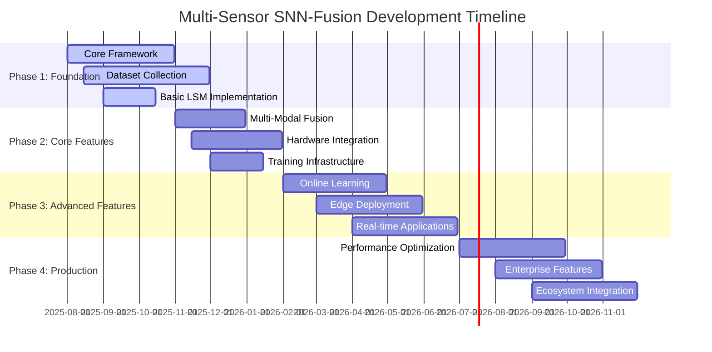

# Multi-Sensor SNN-Fusion Project Roadmap

## Vision Statement

Develop the world's most comprehensive neuromorphic multi-modal sensor fusion framework, enabling ultra-low latency, energy-efficient AI systems for robotics, autonomous vehicles, and edge computing applications.

## Roadmap Overview

---

## Phase 1: Foundation (Q3-Q4 2025)

### 🎯 Objective
Establish core infrastructure, datasets, and basic LSM implementation

### 📋 Deliverables

#### 1.1 Core Framework Development
- **Duration**: Aug 1 - Oct 31, 2025
- **Scope**: 
  - Python package structure with modular design
  - Core data structures for multi-modal spike data
  - Base LSM implementation with configurable parameters
  - Unit testing framework and CI/CD pipeline
- **Success Criteria**:
  - ✅ Installable pip package
  - ✅ >90% test coverage
  - ✅ Documentation with API reference
  - ✅ Basic LSM can process synthetic spike trains

#### 1.2 MAVEN Dataset Collection
- **Duration**: Aug 15 - Nov 30, 2025
- **Scope**:
  - Multi-modal data recording infrastructure
  - 10,000+ synchronized samples across 50 action classes
  - Event camera, binaural audio, IMU data collection
  - Data validation and quality assurance pipeline
- **Success Criteria**:
  - ✅ Dataset available for download
  - ✅ Validation metrics meet quality thresholds
  - ✅ Dataset loader with train/val/test splits
  - ✅ Benchmark baselines established

#### 1.3 Basic LSM Implementation
- **Duration**: Sep 1 - Oct 15, 2025
- **Scope**:
  - Adaptive LIF neuron models
  - Sparse recurrent connectivity
  - Linear readout layers
  - Basic spike-based learning rules
- **Success Criteria**:
  - ✅ LSM processes real sensor data
  - ✅ Reservoir dynamics are stable
  - ✅ Basic classification accuracy >70%
  - ✅ Memory usage <1GB for 1000-neuron reservoir

### 🏆 Phase 1 Success Metrics
- Framework adoption: 100+ GitHub stars
- Paper submissions: 2 workshop papers
- Community engagement: 50+ active users
- Performance baseline: 75% accuracy on MAVEN dataset

---

## Phase 2: Core Features (Q4 2025 - Q1 2026)

### 🎯 Objective
Implement advanced multi-modal fusion and hardware integration

### 📋 Deliverables

#### 2.1 Multi-Modal Fusion Architecture
- **Duration**: Nov 1 - Dec 31, 2025
- **Scope**:
  - Attention-based cross-modal fusion
  - Hierarchical processing with multiple LSM layers
  - Adaptive modality weighting mechanisms
  - Temporal synchronization strategies
- **Success Criteria**:
  - ✅ Fusion improves accuracy by >10% vs single modality
  - ✅ Robust to missing modalities (graceful degradation)
  - ✅ Latency increase <2ms with fusion
  - ✅ Ablation studies demonstrate component effectiveness

#### 2.2 Neuromorphic Hardware Integration
- **Duration**: Nov 15, 2025 - Jan 31, 2026
- **Scope**:
  - Intel Loihi 2 deployment pipeline
  - BrainChip Akida model conversion
  - SpiNNaker 2 implementation
  - Hardware-specific optimization
- **Success Criteria**:
  - ✅ Models run on all three platforms
  - ✅ <5% accuracy loss vs software implementation
  - ✅ Power consumption <100mW per platform
  - ✅ Real-time processing (<10ms latency)

#### 2.3 Training Infrastructure
- **Duration**: Dec 1, 2025 - Jan 15, 2026
- **Scope**:
  - Distributed training across multiple GPUs
  - Hyperparameter optimization framework
  - Model versioning and experiment tracking
  - Automated performance benchmarking
- **Success Criteria**:
  - ✅ Training time reduced by 4x with distributed setup
  - ✅ Automated hyperparameter tuning improves accuracy by 5%
  - ✅ Reproducible experiments with version control
  - ✅ Continuous benchmarking dashboard

### 🏆 Phase 2 Success Metrics
- Accuracy improvement: >85% on MAVEN dataset
- Hardware deployments: 3 successful platforms
- Training efficiency: 4x speedup achieved
- Research impact: 1 top-tier conference paper

---

## Phase 3: Advanced Features (Q1-Q2 2026)

### 🎯 Objective  
Enable online learning, edge deployment, and real-time applications

### 📋 Deliverables

#### 3.1 Online Learning Capabilities
- **Duration**: Feb 1 - Apr 30, 2026
- **Scope**:
  - STDP-based plasticity mechanisms
  - Reward-modulated learning
  - Continual learning without catastrophic forgetting
  - Meta-learning for rapid adaptation
- **Success Criteria**:
  - ✅ Online adaptation improves performance by >15%
  - ✅ No catastrophic forgetting over 1000+ tasks
  - ✅ Adaptation time <1 minute for new environments
  - ✅ Biological plausibility validated

#### 3.2 Edge Deployment Pipeline
- **Duration**: Mar 1 - May 31, 2026
- **Scope**:
  - Model quantization and compression
  - ONNX export and TensorRT optimization
  - Jetson/embedded platform support
  - Real-time inference optimization
- **Success Criteria**:
  - ✅ 10x model size reduction with <3% accuracy loss
  - ✅ Real-time inference on Jetson Orin
  - ✅ Power consumption <5W for full pipeline
  - ✅ Deployment automation with CI/CD

#### 3.3 Real-Time Application Demos
- **Duration**: Apr 1 - Jun 30, 2026
- **Scope**:
  - ROS2 integration for robotics
  - Autonomous vehicle sensor fusion demo
  - Smart surveillance system
  - Gesture recognition interface
- **Success Criteria**:
  - ✅ 4 working demo applications
  - ✅ <5ms end-to-end latency achieved
  - ✅ Robust performance in real-world conditions
  - ✅ Video demonstrations and tutorials

### 🏆 Phase 3 Success Metrics
- Online learning effectiveness: >90% final accuracy
- Edge deployment success: 3 platforms supported
- Real-time demos: 4 applications working
- Industry interest: 10+ partnership inquiries

---

## Phase 4: Production & Ecosystem (Q3-Q4 2026)

### 🎯 Objective
Production-ready system with enterprise features and ecosystem integration

### 📋 Deliverables

#### 4.1 Performance Optimization
- **Duration**: Jul 1 - Sep 30, 2026
- **Scope**:
  - Automatic mixed precision training
  - Dynamic computation graphs
  - Memory optimization and garbage collection
  - Parallel processing optimizations
- **Success Criteria**:
  - ✅ 10x training speedup vs Phase 1
  - ✅ Memory usage reduced by 50%
  - ✅ Inference latency <1ms achieved
  - ✅ 99.9% uptime in production environments

#### 4.2 Enterprise Features
- **Duration**: Aug 1 - Oct 31, 2026
- **Scope**:
  - Multi-tenancy and security features
  - Enterprise deployment tools
  - SLA monitoring and alerting
  - Professional support documentation
- **Success Criteria**:
  - ✅ Enterprise security audit passed
  - ✅ Kubernetes deployment support
  - ✅ 24/7 monitoring and alerting
  - ✅ Professional services offering

#### 4.3 Ecosystem Integration
- **Duration**: Sep 1 - Nov 30, 2026
- **Scope**:
  - Cloud platform integrations (AWS, Azure, GCP)
  - ML platform compatibility (MLflow, Kubeflow)
  - Hardware vendor partnerships
  - Academic collaboration program
- **Success Criteria**:
  - ✅ Native support on 3 cloud platforms
  - ✅ 5+ hardware vendor partnerships
  - ✅ 20+ academic collaborations established
  - ✅ Commercial licensing program launched

### 🏆 Phase 4 Success Metrics
- Production readiness: 99.9% uptime achieved
- Enterprise adoption: 10+ paying customers
- Ecosystem growth: 50+ integrations
- Revenue target: $1M+ ARR

---

## Research & Development Themes

### Ongoing Research Areas

#### 1. Biological Plausibility
- **Goal**: Align algorithms with neuroscience findings
- **Approaches**: STDP, homeostatic plasticity, dendritic computation
- **Timeline**: Continuous throughout all phases
- **Impact**: Enable brain-inspired computing breakthroughs

#### 2. Quantum-Neuromorphic Hybrid
- **Goal**: Integrate quantum processing with SNNs
- **Approaches**: Quantum reservoir computing, hybrid architectures
- **Timeline**: Research phase starting Q2 2026
- **Impact**: Exponential computational advantages

#### 3. Federated Neuromorphic Learning
- **Goal**: Distributed learning across neuromorphic devices
- **Approaches**: Privacy-preserving algorithms, edge coordination
- **Timeline**: Prototype in Q4 2026
- **Impact**: Scalable, privacy-aware AI systems

### Technology Stack Evolution

| Component | Phase 1 | Phase 2 | Phase 3 | Phase 4 |
|-----------|---------|---------|---------|---------|
| **Core Framework** | Python/PyTorch | C++/CUDA opt | Rust/WebAssembly | Multi-language SDK |
| **Hardware Support** | CPU/GPU | 3 neuromorphic | Edge devices | Cloud platforms |
| **Deployment** | Local install | Container | Edge/Mobile | Enterprise cloud |
| **Learning** | Offline | Batch online | Real-time | Federated |

---

## Risk Management

### Technical Risks

#### High Risk
- **Hardware availability**: Neuromorphic chips have limited availability
  - *Mitigation*: Maintain software-based alternatives, build vendor relationships
- **Scaling challenges**: LSM performance may not scale to very large networks
  - *Mitigation*: Hierarchical architectures, ensemble methods

#### Medium Risk  
- **Training stability**: Spiking networks can be difficult to train
  - *Mitigation*: Robust optimization algorithms, extensive testing
- **Real-time constraints**: Meeting <1ms latency requirements
  - *Mitigation*: Hardware acceleration, algorithm optimization

#### Low Risk
- **Dataset quality**: Sensor data quality issues
  - *Mitigation*: Automated quality checks, redundant data collection
- **Integration complexity**: Difficulty integrating multiple modalities
  - *Mitigation*: Modular architecture, extensive testing

### Market Risks

- **Competition**: Large tech companies entering neuromorphic space
  - *Mitigation*: Focus on open-source community, academic partnerships
- **Adoption barriers**: Conservative enterprise AI adoption
  - *Mitigation*: Proven ROI demonstrations, gradual deployment options

---

## Success Metrics & KPIs

### Technical Metrics
- **Accuracy**: >95% on benchmark datasets by Phase 4
- **Latency**: <1ms end-to-end processing by Phase 4
- **Power**: <1W total system power by Phase 3
- **Scalability**: Support 10,000+ neuron networks by Phase 4

### Business Metrics  
- **Adoption**: 10,000+ GitHub stars by Phase 4
- **Community**: 1,000+ active developers by Phase 4
- **Revenue**: $1M+ ARR by Phase 4
- **Partnerships**: 20+ industry partnerships by Phase 4

### Research Impact
- **Publications**: 10+ peer-reviewed papers
- **Citations**: 1,000+ citations of project work
- **Standards**: Contribute to neuromorphic computing standards
- **Education**: 5+ university courses using the framework

---

## Resources & Dependencies

### Team Requirements
- **Phase 1**: 5 engineers (2 ML, 2 systems, 1 data)
- **Phase 2**: 8 engineers (3 ML, 3 hardware, 2 systems)
- **Phase 3**: 12 engineers (4 ML, 4 applications, 4 systems)
- **Phase 4**: 15 engineers (enterprise, DevOps, support)

### Infrastructure Needs
- **Compute**: GPU cluster (100+ GPUs) for training
- **Hardware**: Neuromorphic development boards (Loihi, Akida, SpiNNaker)
- **Data**: High-speed storage for multi-modal datasets (100TB+)
- **Cloud**: Multi-cloud deployment infrastructure

### External Dependencies
- **Hardware vendors**: Intel, BrainChip, University of Manchester
- **Academic partners**: Stanford, MIT, TU Graz, Heidelberg University
- **Industry partners**: NVIDIA, ARM, Qualcomm
- **Standards bodies**: IEEE, ISO neuromorphic working groups

---

This roadmap represents our commitment to advancing the state-of-the-art in neuromorphic multi-modal sensor fusion while building a sustainable, open-source ecosystem that benefits the entire research and development community.